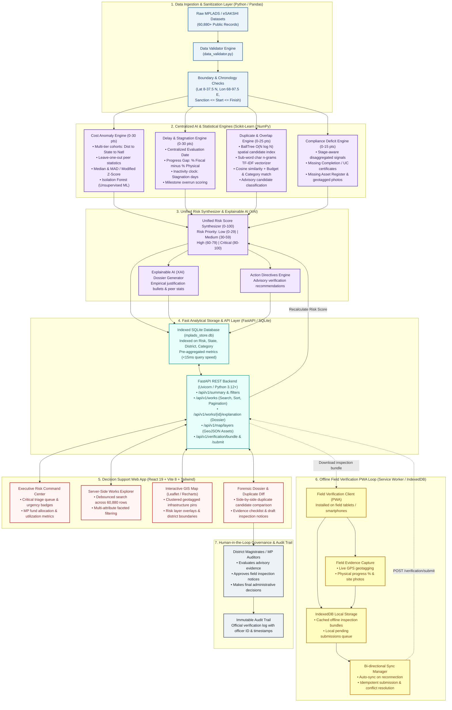

# Explainable Risk Intelligence Layer for MPLADS (ERIL)
## System Flow & Architecture Specification (`flow.md`)

This document details the operational, data, algorithmic, and interaction flows of the **Explainable Risk Intelligence Layer (ERIL)** built for **MPLAD Scheme Anomaly, Risk & Inefficiency Detection**.

---

### 1. High-Level End-to-End Architectural Flowchart & Tech Stack



### 1.1 Tech Stack Matrix

| Layer | Component | Technologies | Key Responsibilities |
| :--- | :--- | :--- | :--- |
| **Data Ingestion & Cleaning** | Pipeline & Validator | Python 3.12+, Pandas, NumPy | Data cleaning, geo-bounds validation (India bounds), and chronological consistency ($Sanction \le Start \le Finish$). |
| **Statistical & ML Engines** | Cost Anomaly Engine | Scikit-learn (`IsolationForest`), SciPy, NumPy | Multi-tier cohorts (leave-one-out), Median Absolute Deviation (MAD), Modified Z-score, unit cost normalization. |
| | Delay Engine | Python datetime, Pandas | Progress gap analysis ($\% \text{Fiscal} - \% \text{Physical}$), inactivity clock against centralized evaluation date. |
| | Duplicate Engine | Scikit-learn (`BallTree`, `TfidfVectorizer`) | $O(N \log N)$ spatial indexing (Haversine distance $\le 150$m), sub-word character $(3, 5)$-gram TF-IDF cosine similarity. |
| | Compliance Engine | Python rule engine | Disaggregated statutory compliance verification (Completion Cert, Asset Register, Geotag, UC). |
| **API & Analytical DB** | REST Backend | FastAPI, Starlette, Pydantic v2, Uvicorn | Asynchronous REST endpoints, strict request validation ($\sum = 100$), CORS security whitelist. |
| | Storage Engine | SQLite 3 (`mplads_store.db`), Python `sqlite3` | Indexed storage across 60,880 records with precomputed query aggregations; queries execute in $< 15$ms. |
| **Frontend Web App** | Single Page App | React 19, Vite 8, JavaScript (ES2024) | High-speed component rendering, virtualized state management, custom SVG radar gauges. |
| | Styling & Design System | Vanilla CSS + Tailwind CSS | Government analytics design system: clean lines, high-contrast accessible typography (Inter), calm status palettes. |
| | Geospatial & Analytics | Leaflet, React-Leaflet, Recharts | Interactive map clustering of geotagged works, risk heatmap layers, peer cost distribution charts, progress bars. |
| **Offline-First PWA** | Client Storage & PWA | Service Worker API, IndexedDB | Caches inspection bundles for offline ground verification in remote rural constituencies, offline form submission. |
| | Synchronization Engine | Fetch API, Background Sync, UUIDv4 | Idempotent sync with server-side version checking (`expected_version`), coordinate discrepancy validation, and real-time risk recalculation. |
| **Testing & Quality** | Quality Assurance | Pytest (38 automated tests), flake8 | Validates API contracts, engine math, spatial distance calculations, data bounds, concurrency safety, and performance constraints. |


---

### 2. Module Execution Details

#### 2.1 Module 1: Cost Outlier Detection Flow
1. **Stratification & Leave-One-Out Exclusion**: All works are grouped by `(work_category, district)`. When evaluating a target work, it is excluded from its own peer cohort so it does not bias peer statistics. If the cohort has fewer than 5 records, it falls back to `(work_category, state)`, then national `work_category`.
2. **Median & MAD Calculation**:
   - $\tilde{C} = \text{Median}(\text{Peer Costs (excluding current work)})$
   - $\text{MAD} = \text{Median}(|C_j - \tilde{C}|)$ for peer works $j \neq i$.
3. **Modified Z-Score & Zero-MAD Fallback**:
   - If $\text{MAD} > 0$: $M_i = \frac{0.6745 \cdot (C_i - \tilde{C})}{\text{MAD}}$
   - If $\text{MAD} = 0$: relative deviation fallback $\frac{|C_i - \tilde{C}|}{\tilde{C}}$ (handling $\tilde{C} = 0$ safely).
4. **Structured Evidence**: Exposes `cost_metric_used` (`SANCTIONED_AMOUNT`), `current_value`, `peer_count`, `peer_median`, `mad`, `modified_z`, `cost_ratio`, and `anomaly_reason`.
5. **Score Allocation**:
   - If Cost Ratio $\ge 1.80\times$ or $M_i \ge 2.5 \implies 26\text{--}30$ pts.
   - If Cost Ratio $\ge 1.45\times$ or $M_i \ge 1.8 \implies 18\text{--}25$ pts.
   - If Cost Ratio $\ge 1.20\times$ or $M_i \ge 1.2 \implies 10\text{--}17$ pts.
   - Normal baseline $\implies 0\text{--}9$ pts.
   - Expenditure overshoot penalty ($>115\%$ of sanction): $+5$ pts.

#### 2.2 Module 2: Delay & Stagnation Detection Flow
1. **Progress Gap Calculation**:
   - $\text{Gap}_{\text{prog}} = \text{Financial Progress } (\%) - \text{Physical Progress } (\%)$
   - Severe Mismatch ($\ge 30\%$ gap): $+14$ pts.
   - Moderate Mismatch ($15\text{--}29\%$ gap): $+9$ pts.
   - Mild Mismatch ($5\text{--}14\%$ gap): $+4$ pts.
2. **Inactivity Clock Calculation**:
   - $\Delta_{\text{dormant}} = \text{Centralized Evaluation Date} - \text{Last Update Date}$
   - Critical Dormancy ($\ge 90$ days): $+8$ pts.
   - Warning Dormancy ($45\text{--}89$ days): $+4$ pts.
3. **Target Date Overrun**:
   - Days overdue beyond expected completion date:
   - Critical Overdue ($> 120$ days): $+8$ pts.
   - Warning Overdue ($45\text{--}120$ days): $+4$ pts.
4. Total delay score capped at 30 points.

#### 2.3 Module 3: Duplicate & Overlap Detection Flow
1. **Stage 1 (Spatial Candidate Pruning)**:
   - Uses Scikit-learn `BallTree(metric='haversine')` to prune candidate pairs within `SPATIAL_RADIUS_METERS` (default 150m), avoiding unnecessary pairwise string comparisons.
2. **Stage 2 (Multi-Attribute Similarity Scoring)**:
   - **Text Cosine Similarity ($S_{\text{text}}$)**: Sub-word character n-grams $(3, 5)$ TF-IDF on work titles.
   - **Geographic Proximity Factor ($S_{\text{geo}}$)**: $\max(0, 1 - \frac{\text{Distance}}{150})$.
   - **Category Match ($S_{\text{cat}}$)**: $1.0$ if matching, else $0.0$.
   - **Agency Match ($S_{\text{agency}}$)**: $1.0$ if matching, else $0.0$.
   - **Budget Proximity ($S_{\text{cost}}$)**: $\frac{\min(\text{Cost}_A, \text{Cost}_B)}{\max(\text{Cost}_A, \text{Cost}_B)}$.
3. **Weighted Duplicate Index (WDI)**:
   - $\text{WDI} = 0.40 \cdot S_{\text{text}} + 0.30 \cdot S_{\text{geo}} + 0.15 \cdot S_{\text{cat}} + 0.10 \cdot S_{\text{agency}} + 0.05 \cdot S_{\text{cost}}$
4. **Signal Strength Classification**:
   - $\text{WDI} \ge 0.80 \implies \text{STRONG CANDIDATE}$
   - $\text{WDI} \ge 0.60 \implies \text{MODERATE CANDIDATE}$
   - $\text{WDI} < 0.60 \implies \text{WEAK CANDIDATE}$
   - Label: strictly **`POSSIBLE DUPLICATE / OVERLAP — VERIFY`**.
5. **Duplicate Risk Points**:
   - $\text{Score} = \text{Round}(\text{WDI} \times 25)$ (0 to 25 points).

#### 2.4 Module 4: Compliance & Documentation Deficit Flow (Stage-Aware)
- Stage-Aware Evaluation:
  - **Ongoing Works**: Evaluated for missing geo-tagged physical progress photograph (+3 pts) and configurable policy threshold review (`UC_REVIEW_FINANCIAL_PROGRESS_THRESHOLD = 75.0%`, +5 pts).
  - **Completed Works**: Evaluated for missing Completion Certificate (+5 pts), missing Final Asset Register entry (+2 pts), missing physical progress photograph (+3 pts), and Utilization Certificate review (+5 pts).
- Total compliance score capped at 15 points.

---

### 3. User Interaction & Operational Flow

```
[District Magistrate / Auditor Logs In]
                   |
                   v
[Navigates to Risk Command Center]
  - Observes: 14 Critical Works requiring immediate scrutiny today
  - Views high-priority alert queue
                   |
                   v
[Clicks Top High-Risk Work (e.g. MPLAD-RJ-2024-0042)]
  - System opens Forensic Evidence Dossier
  - Displays:
    * URS Score: 86/100 (CRITICAL)
    * Component gauge breakdown
    * 5 quantitative evidence bullet points (Cost 1.90x, 38% progress gap, 102 days dormant)
    * Interactive peer cost distribution chart
    * Financial vs Physical progress bar comparison
                   |
                   v
[Explores Geospatial Duplicate Alert]
  - Clicks "Investigate Duplicate Candidate"
  - Screen transitions to Side-by-Side Diff Workspace
  - Inspects Work A vs Work B with linked map markers (35.4m distance)
                   |
                   v
[Takes Administrative Action]
  - Clicks "Generate Field Inquiry Notice"
  - Downloads pre-formatted official notice with specific inquiry questions for field engineers
  - Marks status as "FIELD_INSPECTION_ORDERED"
```
